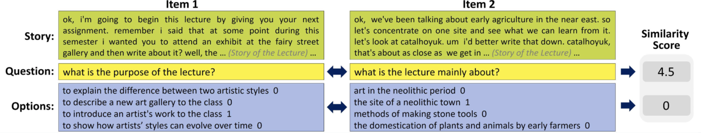

# aSTS-EI
This repository is for the dataset of aSTS-EI, introduced in the paper, Aspect-based Semantic Textual Similarity for Educational Test Items (AIED 2024).

> Our dataset is based on the open source, [https://github.com/iamyuanchung/TOEFL-QA](https://github.com/iamyuanchung/TOEFL-QA) (Bo-Hsiang Tseng & Yu-An Chung).

## Task Overview
Below is an example illustrating aspect-wise similarity between two test items, where they are similar in the *Question* aspect but differ in the *Story* and *Options* aspects. Thus, the example emphasizes the need for aspect-wise comparison over holistic approaches.

